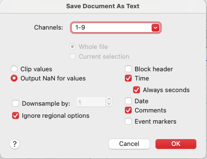

# LabChart Parser

Parser for ADInstruments LabChart text exports (`.txt` files).  

Converts exported LabChart data into a pandas DataFrame with blocks, continuous time, and comments.

- Parse LabChart `.txt` exports using [labchart_parser](https://github.com/Neures-1158/labchart_txt_parser).  

## Export from labchart as .txt

Export from labchart as follows:
- 
  

    - Before exporting in LabChart, make sure time is displayed as "Start from Block"


## Installation

**Prerequisites**: Python ≥3.8, pip ≥21, and git must be installed.

### For users

Install directly from GitHub:

```bash
pip install git+https://github.com/Neures-1158/labchart_txt_parser.git
```

### For developers

Clone this repository and install in editable mode:

```bash
git clone https://github.com/Neures-1158/labchart_txt_parser.git
cd labchart_txt_parser
pip install -e .
```

## Usage

See the [examples/example_usage.py](examples/example_usage.py) script for a complete demonstration of:

- Loading a LabChart text file.
- Accessing metadata, blocks, and channel names.
- Working with comments (`INSPI`, `EXPI`, etc.).
- Plotting signals using matplotlib.
- Performing cycle-by-cycle calculations.

To run the example:

```bash
python examples/example_usage.py
```

## License

MIT License. See the [LICENSE](LICENSE) file for details.


## Contributors & Maintainers

This project is maintained under the [NEURES Lab](https://github.com/Neures-1158) GitHub organization.  
Main maintainer: **Damien Bachasson** (author and lead developer).

Contributions from lab members and collaborators are welcome.
