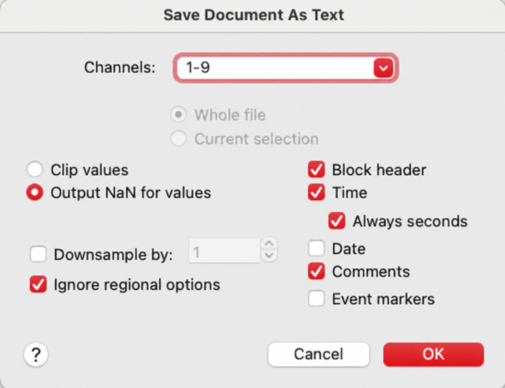

# LabChart Parser

[](https://github.com/Neures-1158/labchart_txt_parser/actions/workflows/ci.yml)
[](https://opensource.org/licenses/MIT)
[](https://www.python.org/downloads/)

Parses ADInstruments LabChart `.txt` exports into a pandas DataFrame with
blocks, continuous time, and comments.

## Export from LabChart



Set time display to **"Start from Block"** before exporting, and make sure **"Block header"** is ticked.

## Install

```bash
pip install git+https://github.com/Neures-1158/labchart_txt_parser.git
```

For development: `pip install -e ".[dev]"` (adds pytest, ruff, black, isort).

## Quick start

```python
from labchart_parser import LabChartFile

lc = LabChartFile.from_file("data/recording.txt")

lc.metadata             # dict; per-block metadata under lc.metadata["blocks"]
lc.channels             # ['Flow', 'Pressure', 'Volume', ...]
lc.blocks               # [1, 2, 3, ...]
lc.get_block_df(1)      # one block as a DataFrame
lc.get_channel(1, "Pressure")
lc.slice_time_abs(10.0, 20.0)
lc.plot_channel("Flow", block=1)
```

A walkthrough notebook lives at [examples/labchart_parser_walkthrough.ipynb](examples/labchart_parser_walkthrough.ipynb).
For breath-by-breath analysis on top of this parser, see [resp_metrics](https://github.com/Neures-1158/resp_metrics).

## Tests

```bash
pytest
```

## Maintainer

Maintained under [NEURES](https://github.com/Neures-1158). Lead: Damien
Bachasson, PhD ([GitHub](https://github.com/dambach) ·
[ORCID](https://orcid.org/0000-0001-6335-9916) ·
[Lab](https://sante.sorbonne-universite.fr/structures-de-recherche/neurophysiologie-respiratoire-experimentale-et-clinique)).
Issues and PRs welcome.

MIT licensed — see [LICENSE](LICENSE).
